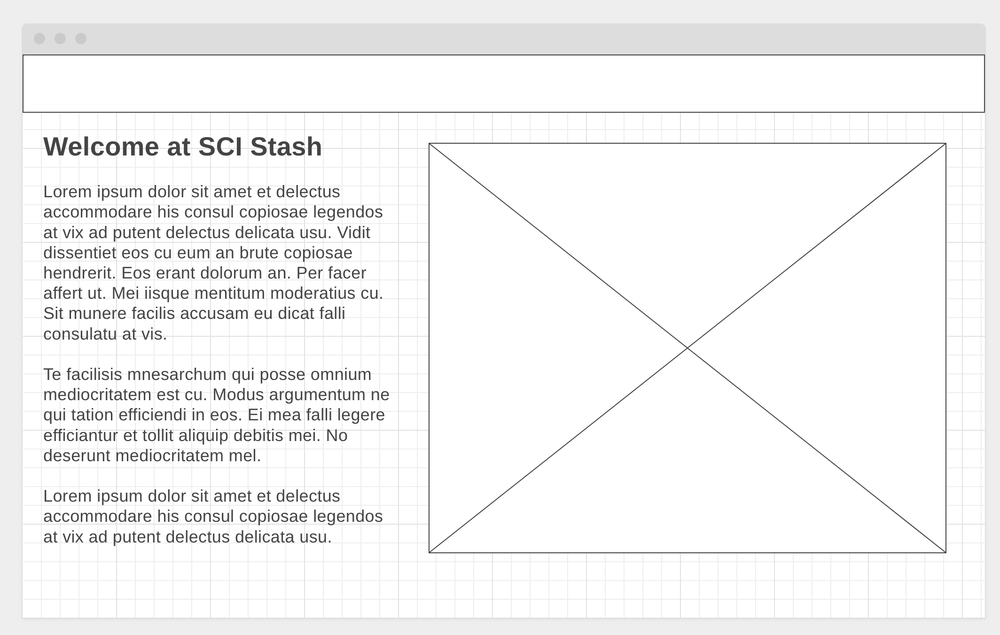
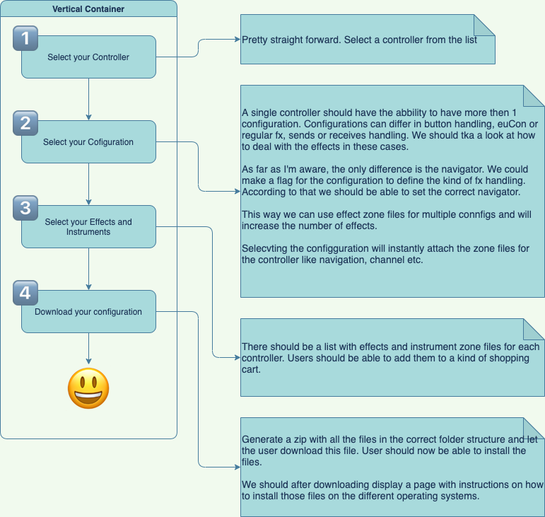
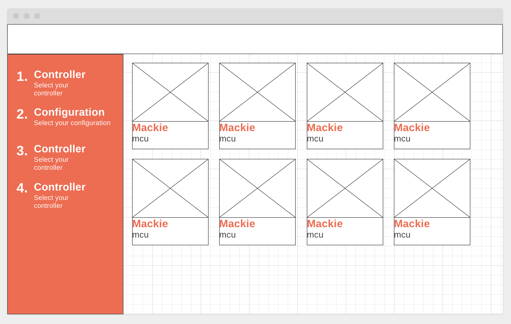
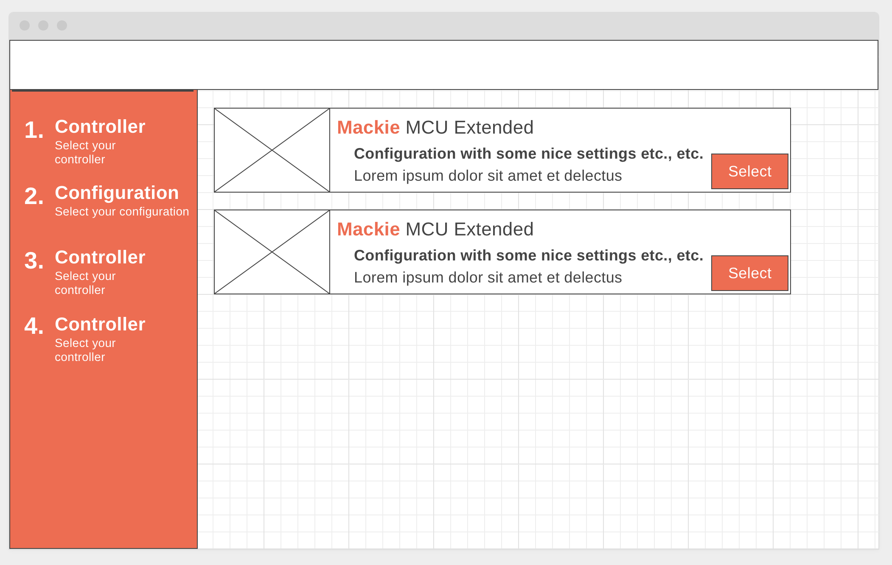
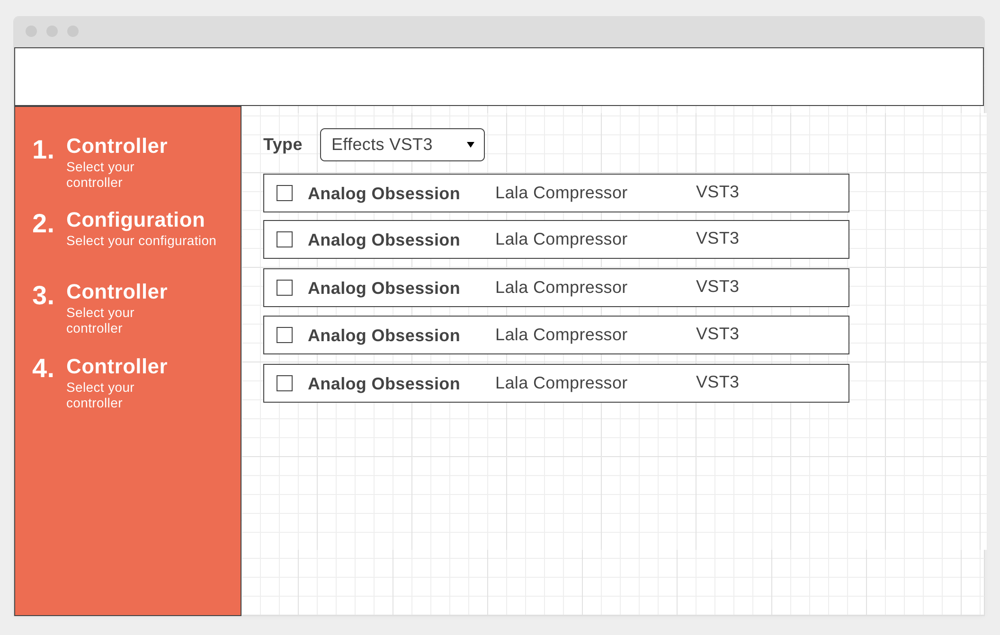
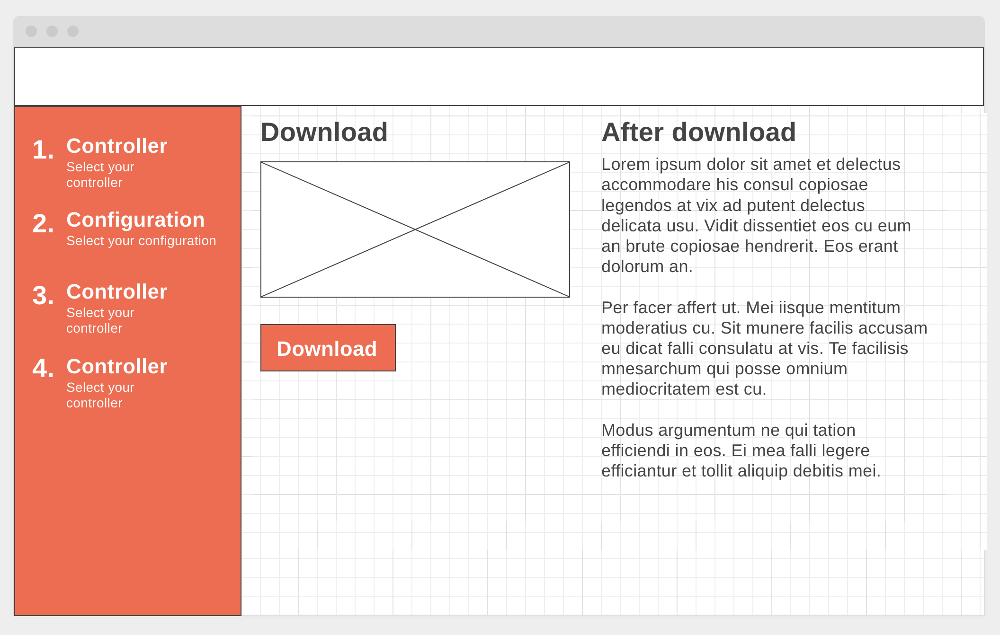

## Home:  

* https://wireframe.cc/lvAwRh

* The text part welcomes and gives an explanation
* Tha image can be used for a descriptive image

## Configuration:

### Overview

The overall virew could look like:

### The steps

1. Step 1: Controllers
    * https://wireframe.cc/sDl74z
    * 
    * Display the list with controllers. Clicking one will go to the next step
    * Maybe add a button for clicking (more consistant with the nexy step)
1. Step 2: Configurations
    * https://wireframe.cc/k5ShkL
    * 
    * Select the configuration. Each configuration has:
      * controller image
      * Controller info
      * Configuration name
      * Configuration description (maybe collapsable, depending on the length of the text)
      * Button for the next step
1. Step 3: Effects and plugins
    * https://wireframe.cc/jhsuQ3
    * 
    * Page has:
      * List with all the option
        Each item has:
          * plgin name
          * plugin developer
          * plugin type
      * Checkbox for selecting effects, instruments and fx type (vst, au, etc)
      * (Not in the image) List with currently selected items
      * (Not in the image) Button for going to the last step
1. Step 4: Download
    * https://wireframe.cc/mdiUB8
    * 
    * Shows the downpad button and some additional info
